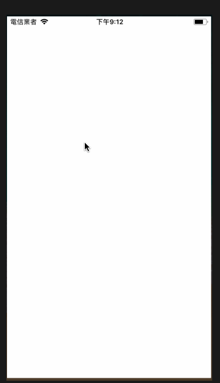

# 課題: 下午四點前要自己想一個遊戲並實作出來
條件：
1. 要能夠重來
2. 要能計分
3. 要有動畫
4. 中午以前不能討論
5. 要協調不能做一樣的遊戲
6. 不能動到他人的Git
7. 開始前要先玩訓練盒App，解鎖到第七關（模擬實際在做事情時有時會有額外事件，並作為遊戲靈感參考）

# 手勢遊戲
當出現藍色箭頭，則手勢要跟箭頭方向一樣才有分數；如果出現紅色箭頭，則手勢要與箭頭方向相反才計分，限時20秒

