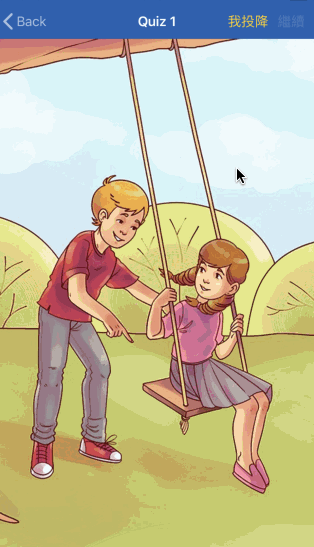

# 時間限時賽
### 2018 年 5 月 15日
現實生活中，你常常會接到一個任務卻有一堆雜事讓你不能單純把一件事情做好。 今天這個任務就是做一個遊戲，而這個雜事就是你要玩好一個遊戲。

雜事：下載「訓練盒」，10:00前解鎖 7個關卡，可以繼續下面的任務。

任務：做一個遊戲

* 有分數的機制，可以重新開始，要有動畫。
* 中午吃飯以前不能討論。
* 發現有做一樣規則的遊戲，需要協調否則都算 fail
* 專案必須要上 Github
* 如果有人勿操作 Git 把別人的專案弄掉了，直接 fail

# 遊戲介紹 - 大家來找碴
* 遊戲有三個關卡，每次畫面不一定只有一個答案，但只要答對一個就算過關
* 請用 iPhone 8 Plus 模擬器開啟專案
---
### 遊戲畫面

