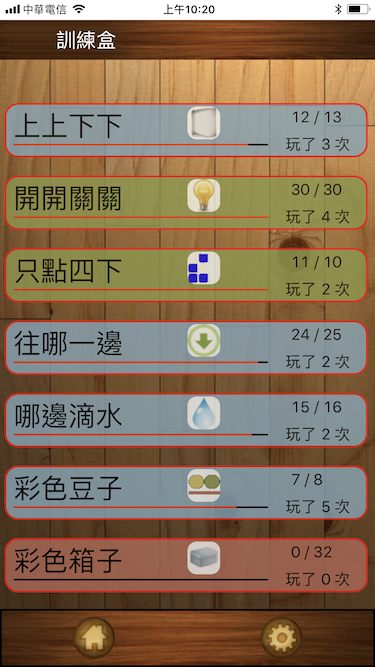

# 訓練盒

## 簡介
2018年5月15日

現實生活中，你常常會接到一個任務卻有一堆雜事讓你不能單純把一件事情做好。
今天這個任務就是做一個遊戲，而這個雜事就是你要玩好一個遊戲。

### Host 
Don

### Members
Jeremy / Iris / Ells / Gavin / 菘駿 / Morris / Ethan / Sonny

---

### 雜事
下載「[訓練盒](https://itunes.apple.com/tw/app/%E8%A8%93%E7%B7%B4%E7%9B%92-exercise-box/id938123286?mt=8)」，10:00前解鎖 7個關卡，可以繼續下面的任務。

---

### 任務
做一個遊戲條件如下

- 分數的機制
- 能夠重新開始
- 有動畫

---

### 須知
- 中午吃飯以前不能討論遊戲內容
- 專案必須要上 Github
- 發現有做一樣規則的遊戲，需要協調否則都算 fail
- 如果有人勿操作 Git 把別人的專案弄掉了，直接 fail
- Deadline 下午四點
- Fail 的學員這週不用進工作室了
